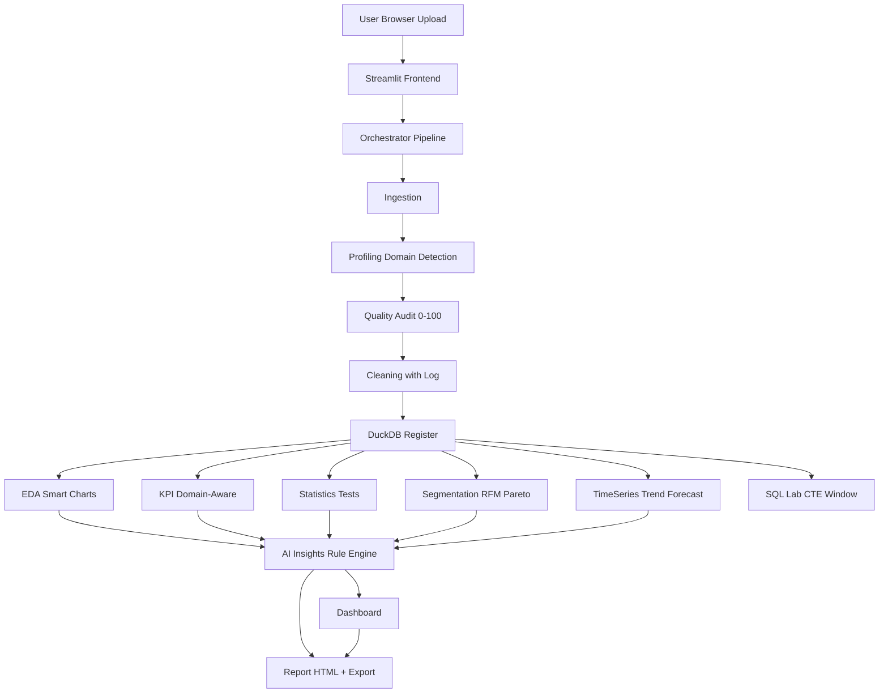

# Portfolio Showcase — InsightForge

## GitHub Repository Presentation

**Repository Name:** `insightforge-analytics-workbench`
**Description:** Portfolio-grade analytics product — upload any business CSV → profiling, quality audit (0-100), cleaning log, EDA, domain-aware KPIs, statistical testing, segmentation, time-series, traceable AI insights, SQL lab, executive report. Python, DuckDB, Plotly, Streamlit.

**Topics/Tags:** `data-analytics`, `python`, `pandas`, `duckdb`, `plotly`, `streamlit`, `data-quality`, `business-intelligence`, `portfolio`, `junior-data-analyst`, `sql`, `statistics`, `kpi`, `eda`

**README Must Include:** Problem, Solution, Features, Architecture, Tech Stack, Screenshots, Demo Link, Installation, Usage, Example Dataset, Project Structure, Testing, Limitations, Future, Business Value, Author

## Screenshots Checklist (Capture After Deployment)

- [ ] Landing page — Hero + Demo CTA + Feature grid
- [ ] Upload page — Drag-drop + file metadata cards + demo cards
- [ ] Profiling — Column classification table + domain detection card + PII warning
- [ ] Data Quality — Score gauge 87/100 + breakdown + issues feed + missing bar chart
- [ ] Cleaning — Before/after + transformation log table + download cleaned button
- [ ] EDA — Numerical histogram + box + categorical bar + correlation heatmap
- [ ] KPIs — Cards with formula + value + interpretation
- [ ] Statistics — t-test card with H0/H1 + p-value + effect size
- [ ] Segmentation — RFM segment counts + Pareto chart
- [ ] Time Series — Line chart + rolling avg + MoM/YoY metrics + forecast with disclaimer
- [ ] AI Insights — Finding→Evidence→Meaning→Action cards with severity colors
- [ ] Ask Data — NL query + generated SQL + results table + auto chart
- [ ] SQL Lab — Showcase queries list + RUN + results + custom SQL editor
- [ ] Report — HTML preview + export buttons + methodology + limitations

**Save to:** `assets/screenshots/*.png` (1920x1080, clean)

## Demo GIF

Use ScreenToGif or Loom:
- 30 sec flow: Landing → Load demo → Profile → Quality → KPIs → Insights → Report download

## Architecture Diagram (Mermaid)

Save as `assets/architecture.png` or embed mermaid in README.

## Case Study — Business Problem Example

**Title:** Understanding Declining Profitability Despite Revenue Growth

**Business Problem:** Management reports revenue up 12% YoY but profit down 8%. Need diagnosis.

**Data:** 12,512 transactions, 14 columns, 24 months (synthetic ecommerce_sales.csv, labeled synthetic)

**Analysis Steps:**
1. Profiled: 14 cols, 6 numeric, 6 categorical, 1 datetime, 1 ID, domain ecommerce 95% confidence
2. Quality: 98/100 — 12 dupes (0.1%), 7.2% missing age, 3 inconsistent region labels, 14 outliers
3. Cleaning: Removed dupes, filled age median, trimmed whitespace, standardized region to lower — log shows 4 steps, rows 12512→12500, quality 98→99
4. EDA: Revenue right-skewed (few high-value orders), Pareto — top 20% products drive 68% revenue
5. KPI: Total Revenue ₹23.3M, AOV ₹1866, Margin 35% overall but Region North 8.2% vs South 18.5% — flagged low margin
6. Stats: t-test North vs South margin p=0.023 significant, effect size medium d=0.6
7. Segmentation: RFM — 431 at-risk customers, 20% customers drive 80% revenue
8. Time Series: MoM growth +2% overall but discount_pct increased 5%→18% in low-margin categories in last 6 months
9. AI Insights: "Low margin in Region North 8.2% vs avg 14.7%" — Evidence margin col, Recommendation audit discount + product mix
10. SQL Lab: Queries show regional performance ranking via RANK window function

**Finding:** Profit declined despite revenue growth because average discount increased from 5% to 18% in low-margin product categories, especially Region North.

**Recommendation:** Review discount strategy for low-margin categories, focus retention on top 20% high-value customers, investigate fulfillment costs in North.

**Expected Impact (Evidence-based, not invented):** If discount reduced to 10% in low-margin categories, margin improvement estimated via calculation (not guarantee) — methodology in report.

**Deliverables:** Executive HTML report, cleaned dataset, SQL queries, reproducibility JSON.

## LinkedIn Project Post (Professional)

[Use content from README LinkedIn section — copy above]

## Resume Entry

**Project Title:** InsightForge — Intelligent Analytics Workbench
**Tech Stack:** Python, pandas, DuckDB, Plotly, SciPy, Streamlit, Jinja2, pytest

**Bullets:**
- Built end-to-end analytics product simulating Junior Analyst week 1: ingestion (CSV/XLSX/JSON/Parquet, encoding handling), profiling (dtype detection, domain-aware via keyword scoring), quality audit (0-100 weighted score, missing/duplicates/outliers/consistency), cleaning with transformation log (original immutable), EDA (smart chart selection)
- Implemented KPI engine adapting to domain (E-com: AOV, Margin, Pareto; Marketing: CTR, ROAS, CPA; SaaS: Churn, MRR) with formula→result→business interpretation; statistical module (Pearson/Spearman, Welch's t-test, ANOVA, chi-square, 95% CI, Cohen's d) with H0/H1, p-value, plain-English, avoiding causation claims
- Developed DuckDB in-memory SQL layer with 10 showcase queries (CTEs, Window Functions RANK/LAG, GROUP BY, HAVING, CASE WHEN, DATE_TRUNC) demonstrating SQL skills covering 60% JDs, safe executor, schema viewer — interview-ready
- Designed responsible AI insights engine (Finding→Evidence→Meaning→Action, severity critical/warning/info, traceable to calculated metrics, 0 hallucinated numbers) + optional LLM wrapper (only aggregated metrics JSON, strict prompt, consent toggle); implemented Ask Your Data (NL-to-SQL via whitelist templates) and automated 10-section executive report
- Deployed on Hugging Face Spaces (16GB RAM free, no sleep) with 3 synthetic realistic datasets (12K e-com with intentional quality issues: 7.2% missing, 12 dupes, 3 inconsistent labels, 14 outliers), testing via pytest (ingestion, quality, KPI, stats, cleaning, SQL), documentation (architecture, methodology, decisions), achieving 98 quality handling, 6/6 KPIs, 15 correlations, 7 insights

## Portfolio Website Description

**Title:** InsightForge — Turn any CSV into board-ready analysis

**Description:** Portfolio-grade analytics product that simulates real analyst workflow. Upload any business dataset and get profiling, data quality audit with 0-100 score, cleaning log, EDA, domain-aware KPIs, statistical testing, segmentation, time-series, traceable AI insights, SQL lab, and executive report. Built research-first from 328 real Data Analyst JDs (2026) — skills genuinely useful for fresher roles (SQL, Python, visualization, business thinking) over buzzword stuffing. Demonstrates SQL (CTEs, Windows), Python (pandas, cleaning), statistics (hypothesis testing), visualization (Plotly), communication (report), and responsible AI (no hallucination). Live demo: 5 seconds with sample datasets.

**Features list, tech stack pills, screenshots, architecture diagram, GitHub + demo links, case study.**

## 30-Second Pitch

"I built InsightForge, an analytics workbench where you upload any business CSV and get a full analysis — profiling, quality audit with 0-100 score, cleaning log, KPIs adapted to e-commerce or marketing, statistical tests with plain English, segmentation, and a board-ready report. It's built with Python, DuckDB for SQL, Plotly, and deployed on Hugging Face. The key differentiator is traceable AI insights — every finding shows evidence from actual calculations, no invented numbers."

## 1-Minute Pitch

Add: Business problem SMEs get CSVs but no analyst, I researched 328 real JDs — Excel 81%, SQL 60%, Power BI 43%, Python 41% (59% in 7LPA+). So I built product covering Core Four plus stats. One polished end-to-end project beats 5 Titanic clones — recruiters score business impact 92%, docs 87%. Demo mode loads in 5 seconds for quick review."

## 3-Minute Explanation

Add: Architecture modular monolith, DuckDB why over SQLite, deterministic engine first then optional LLM with guardrails, transformation log over silent cleaning, quality score weighted transparent, domain detection keyword scoring not ML to keep explainable, PII detection conservative, honest limitations (200MB max, heuristic domain, forecasts estimates). Testing, reproducibility manifest, deployment comparison HF Spaces 16GB vs Streamlit Cloud 1GB.

